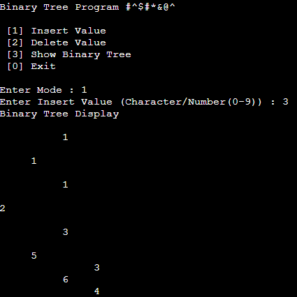

##  DATA-STRUCTURES-ALGORITHMS💻🔢

## Description 📝
This project develops a system to manage numbers using a Binary Tree 🌳, providing efficient data operations such as adding ➕, deleting ➖, and displaying data 📊. 
The system is implemented in C 💻 and leverages the Binary Tree algorithm to handle and organize data in a structured way, optimizing search, insertion, and deletion processes.
 With this approach, it improves the management of sequential data 🔢 and allows users to interact with it efficiently, ensuring scalability and quick access to data.

## Features 🛠️
- Adding Numbers ➕
    - Adds new numbers to the Binary Tree, ensuring the correct order of data storage.
- Deleting Numbers ➖
    - Deletes numbers from the Binary Tree, maintaining the structure and balance of the tree.
- Display Data 📊
    - Displays all the data in the Binary Tree using traversal methods such as In-order traversal or Pre-order traversal.

## Technologies Used ⚙️
- C
## Screenshots 📸

## Author ✍️
